# Android UI Libraries

### [Android-Iconics](#android-iconics)

[https://github.com/mikepenz/Android-Iconics](https://github.com/mikepenz/Android-Iconics)

[http://mikepenz.github.io/Android-Iconics](http://mikepenz.github.io/Android-Iconics)

[Demo APK](https://github.com/mikepenz/Android-Iconics/releases/download/v2.8.1/Android-Iconics-v2.8.1.apk)

Android-Iconics - Use any icon font, or vector (.svg) as drawable in your application.


**Choose your desired fonts:**

```
compile 'com.mikepenz:google-material-typeface:3.0.1.0.original@aar'
compile 'com.mikepenz:material-design-iconic-typeface:2.2.0.2@aar'
compile 'com.mikepenz:fontawesome-typeface:4.7.0.0@aar'
compile 'com.mikepenz:octicons-typeface:3.2.0.2@aar'
compile 'com.mikepenz:meteocons-typeface:1.1.0.2@aar'
compile 'com.mikepenz:community-material-typeface:1.8.36.1@aar'
compile 'com.mikepenz:weather-icons-typeface:2.0.10.2@aar'
compile 'com.mikepenz:typeicons-typeface:2.0.7.2@aar'
compile 'com.mikepenz:entypo-typeface:1.0.0.2@aar'
compile 'com.mikepenz:devicon-typeface:2.0.0.2@aar'
compile 'com.mikepenz:foundation-icons-typeface:3.0.0.2@aar'
compile 'com.mikepenz:ionicons-typeface:2.0.1.2@aar'
```

### [PhotoView](#photo-view)

[https://github.com/chrisbanes/PhotoView](https://github.com/chrisbanes/PhotoView)

**Useage**

```
allprojects {
    repositories {
        maven { url "https://jitpack.io" }
    }
}
dependencies {
    compile 'com.github.chrisbanes:PhotoView:latest.release.here'
}
```

### [Android-StepsView](#android-stepsview)

[https://github.com/anton46/Android-StepsView](https://github.com/anton46/Android-StepsView)

[http://anton46.com/](http://anton46.com/)


**Usage**

```
compile 'com.anton46:stepsview:0.0.2'
```

```xml
<com.anton46.stepsview.StepsView
        xmlns:app="http://schemas.android.com/apk/res-auto"
        android:id="@+id/stepsView"
        android:layout_width="match_parent"
        android:layout_height="wrap_content"
        />
```

```java
mStepsView.setLabels(steps)
        .setBarColorIndicator(getContext().getResources().getColor(R.color.material_blue_grey_800))
        .setProgressColorIndicator(getContext().getResources().getColor(R.color.orange))
        .setLabelColorIndicator(getContext().getResources().getColor(R.color.orange))
        .setCompletedPosition(0)
        .drawView();
```

### [Android Image Slider](#android-image-slider)

[https://github.com/daimajia/AndroidImageSlider](https://github.com/daimajia/AndroidImageSlider)

[Demo APK](https://github.com/daimajia/AndroidImageSlider/releases/download/v1.0.8/demo-1.0.8.apk)

<div>
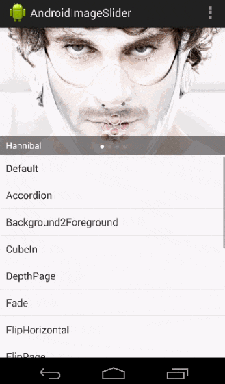
</div>

### [SparkButton](#sparkbutton)

Highly customizable and lightweight library that allows you to create a button with animation effect similar to Twitter's heart animation.

[https://github.com/varunest/SparkButton](https://github.com/varunest/SparkButton)

<div>

</div>

### [BetterPickers](#betterpickers)

Android library for better date/time Picker DialogFragments

[https://github.com/code-troopers/android-betterpickers](https://github.com/code-troopers/android-betterpickers)

[Demo APK](https://github.com/code-troopers/android-betterpickers/releases/download/3.1.0/sample-debug.apk)

<div>


</div>

### [android-shape-imageview](#android-shape-imageview)

Custom shaped android imageview components

[https://github.com/siyamed/android-shape-imageview](https://github.com/siyamed/android-shape-imageview)

<div>


</div>

### [Android StackBlur](#android-stackblur)

Android StackBlur is a library that can perform a blurry effect on a Bitmap based on a gradient or radius, and return the result. The library is based on the code of Mario Klingemann.

[https://github.com/kikoso/android-stackblur](https://github.com/kikoso/android-stackblur)

<div>
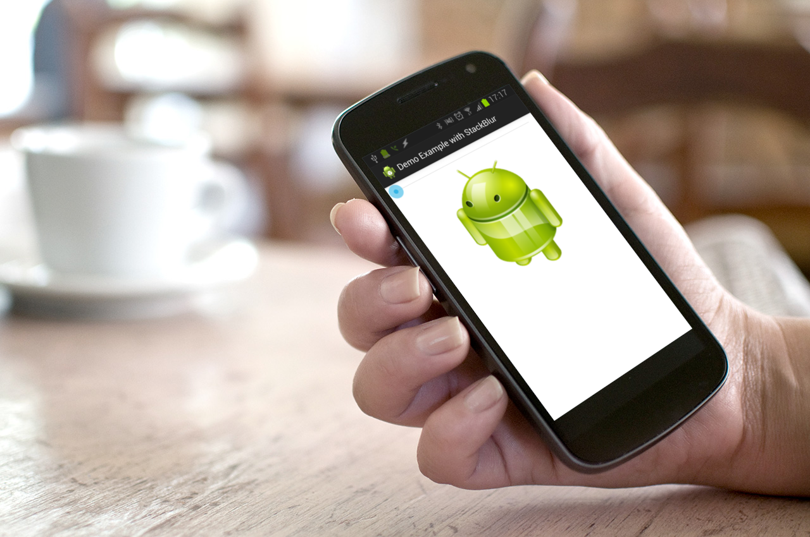
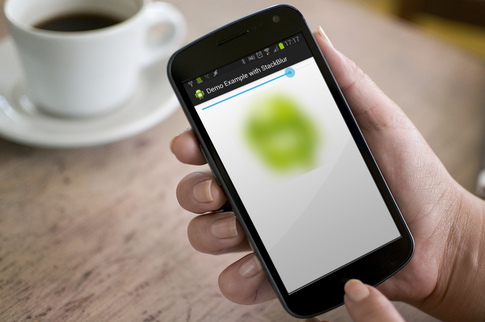
</div>

### [Android Bootstrap](#android-bootstrap)

Bootstrap style widgets for Android, with Glyph Icons

[https://github.com/Bearded-Hen/Android-Bootstrap](https://github.com/Bearded-Hen/Android-Bootstrap)

<div>
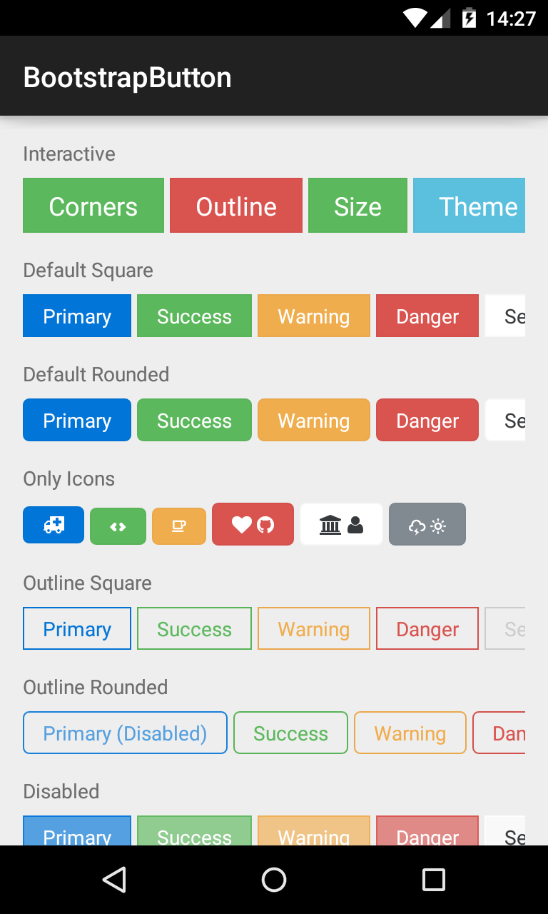
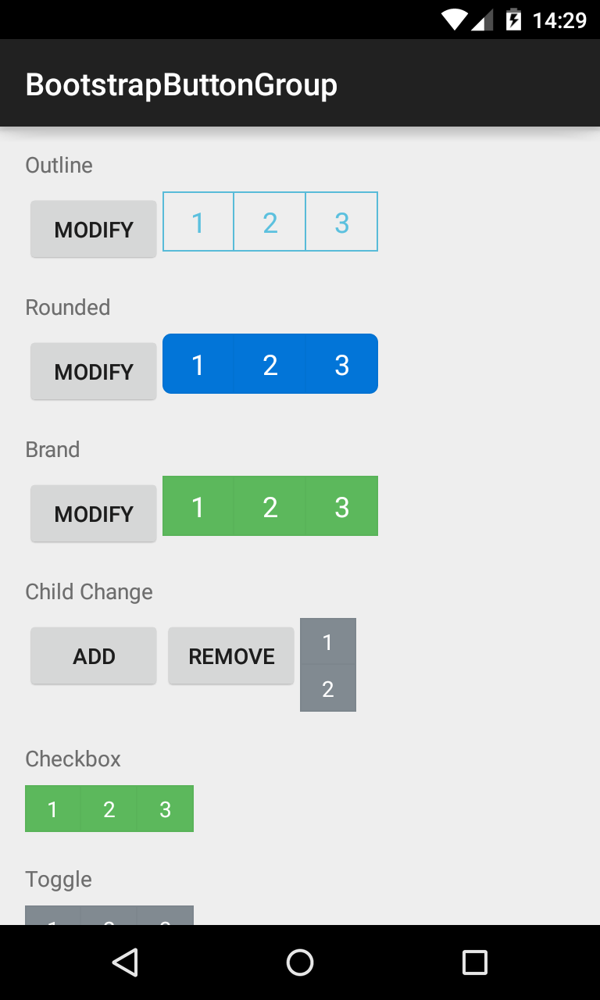
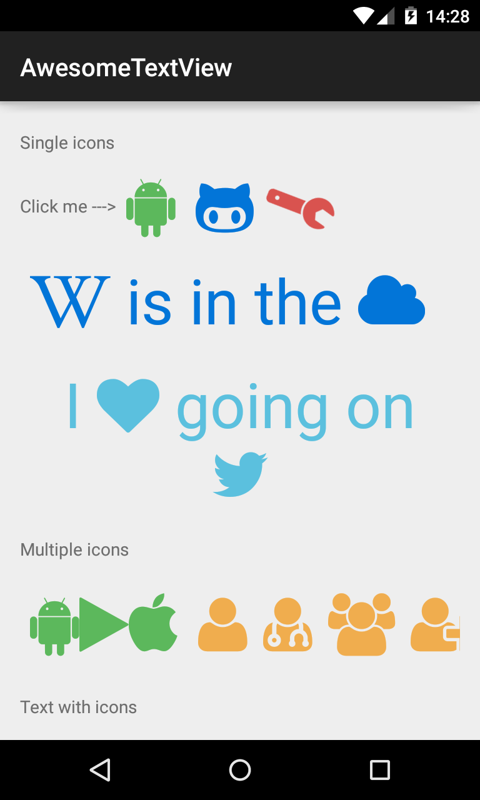
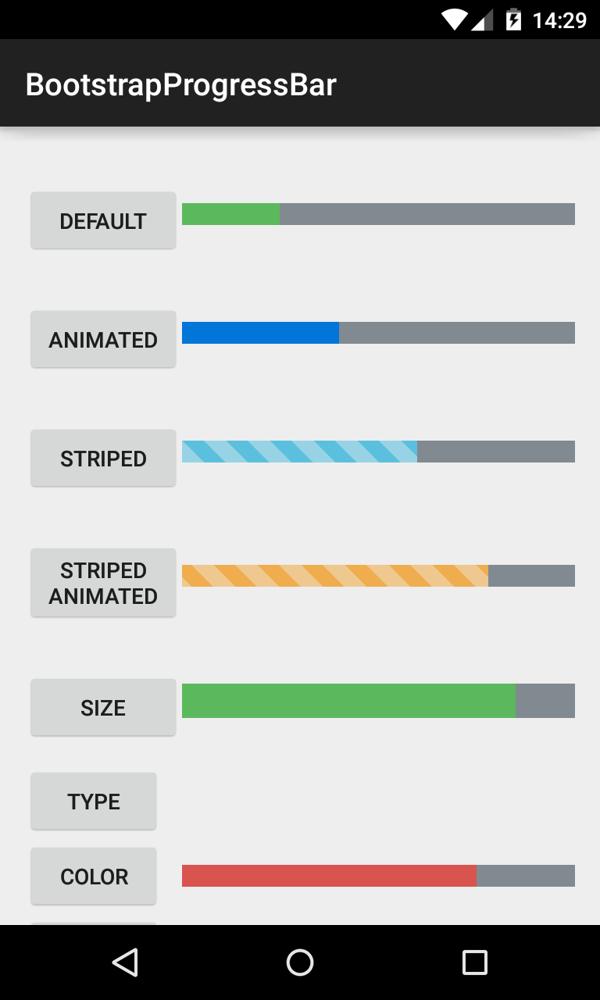
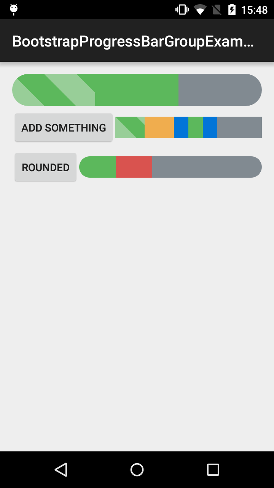
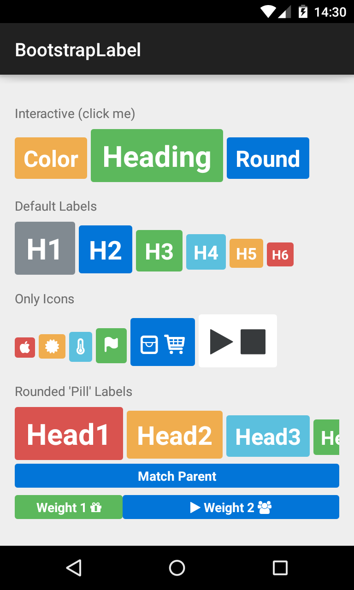
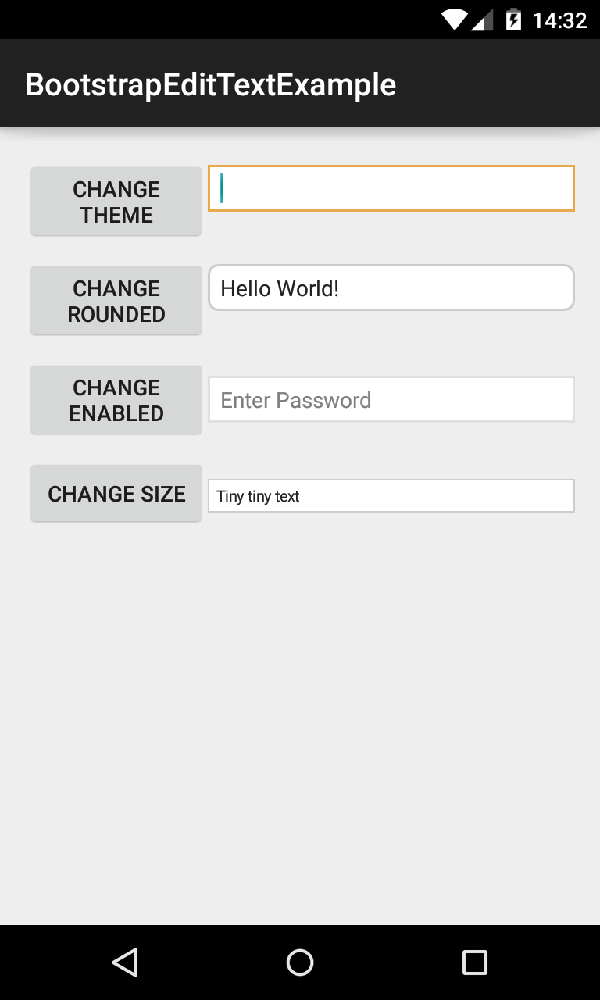
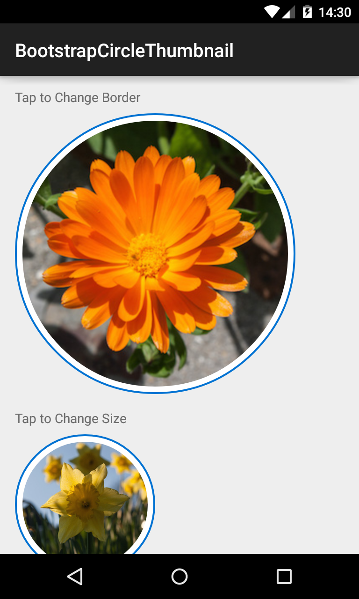
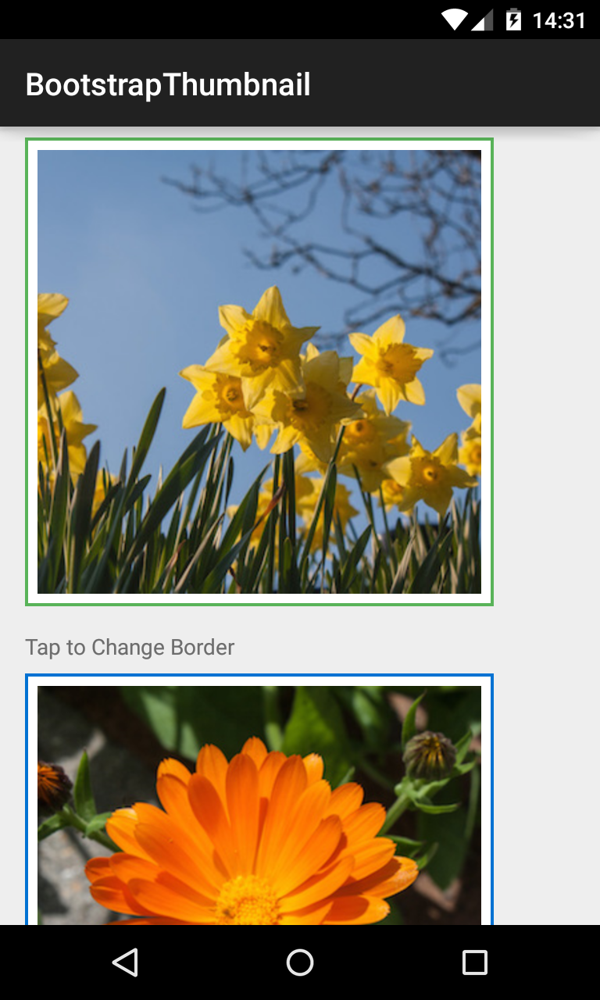
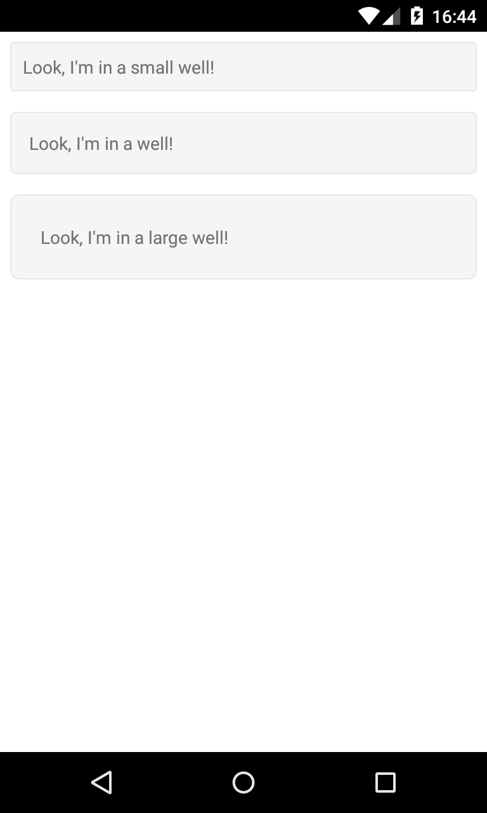
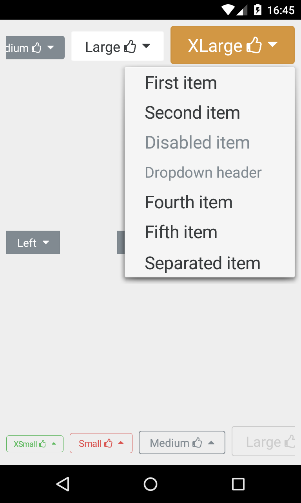
</div>

### [ShowcaseView](#ShowcaseView)

The ShowcaseView (SCV) library is designed to highlight and showcase specific parts of apps to the user with a distinctive and attractive overlay. This library is great for pointing out points of interest for users, gestures, or obscure but useful items.

[https://github.com/amlcurran/ShowcaseView](https://github.com/amlcurran/ShowcaseView)

[Demo APK](https://github.com/amlcurran/ShowcaseView/releases/download/5.4.0/sample-release.apk)

<div>


</div>

### [AndroidViewAnimations](#android-view-animations)

Cute view animation collection.

[https://github.com/daimajia/AndroidViewAnimations](https://github.com/daimajia/AndroidViewAnimations)

[Demo APK](https://github.com/daimajia/AndroidViewAnimations/releases/download/v1.1.2/AndroidViewAnimations-1.1.2.apk)

<div>
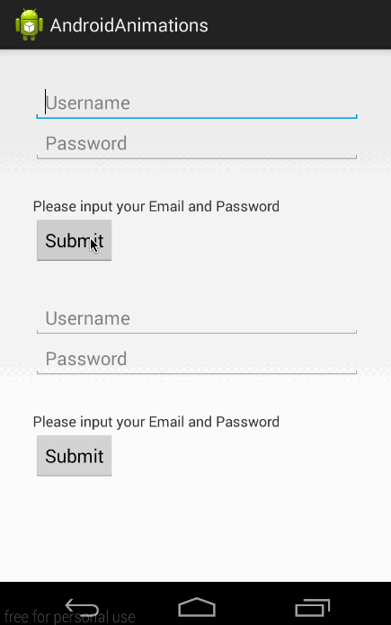
</div>

### [SmoothProgressBar](#smoothprogressbar)

A small Android library allowing you to have a smooth and customizable horizontal indeterminate ProgressBar.

[https://github.com/castorflex/SmoothProgressBar](https://github.com/castorflex/SmoothProgressBar)

<div>

</div>


### [CircularFillableLoaders](#circular-fillable-loaders)

[https://github.com/lopspower/CircularFillableLoaders](https://github.com/lopspower/CircularFillableLoaders)

### [FloatingActionButton](#FloatingActionButton)

Android Floating Action Button based on Material Design specification, yet another implementation of [Floating Action Button](http://www.google.com/design/spec/components/buttons.html#buttons-floating-action-button) for Android with lots of features.

[https://github.com/Clans/FloatingActionButton](https://github.com/Clans/FloatingActionButton)

<div>


</div>

### [Foursquare-CollectionPicker](#Foursquare-CollectionPicker)

Collection Picker is an Android View library that looks like Foursquare Tastes picker.

[https://github.com/anton46/Foursquare-CollectionPicker](https://github.com/anton46/Foursquare-CollectionPicker)

<div>


</div>

### [Scissors](#Scissors)

Fixed viewport image cropping library for Android with built-in support for [Picasso](https://github.com/square/picasso), [Glide](https://github.com/bumptech/glide) or [Universal Image Loader](https://github.com/nostra13/Android-Universal-Image-Loader).

[https://github.com/lyft/scissors](https://github.com/lyft/scissors)

<div>

</div>

### [MaterialSearchView](#MaterialSearchView)

Cute library to implement SearchView in a Material Design Approach.

[https://github.com/MiguelCatalan/MaterialSearchView](https://github.com/MiguelCatalan/MaterialSearchView)

[http://miguelcatalan.info/2015/09/23/MaterialSearchView/](http://miguelcatalan.info/2015/09/23/MaterialSearchView/)

[http://www.materialdoc.com/search-filter/](http://www.materialdoc.com/search-filter/)

<div>


</div>

### [BadgeView](#BadgeView)

a BadeView base on android

[https://github.com/AlexLiuSheng/BadgeView](https://github.com/AlexLiuSheng/BadgeView)

<div>

</div>

### [Material Dialogs](#material-dialogs)

A beautiful, fluid, and customizable dialogs API. 

[https://github.com/afollestad/material-dialogs](https://github.com/afollestad/material-dialogs)

[Demo APK](https://github.com/afollestad/material-dialogs/blob/master/sample/sample.apk)


### [Android-SplashView](#android-splashview)

A SplashView injecting to any activity for android. 

[https://github.com/jkyeo/Android-SplashView](https://github.com/jkyeo/Android-SplashView)

[http://jkyeo.com/2016/07/10/SplashView-一行代码解决闪屏页(广告页)-Android-篇](http://jkyeo.com/2016/07/10/SplashView-%E4%B8%80%E8%A1%8C%E4%BB%A3%E7%A0%81%E8%A7%A3%E5%86%B3%E9%97%AA%E5%B1%8F%E9%A1%B5-%E5%B9%BF%E5%91%8A%E9%A1%B5-Android-%E7%AF%87/)

<div>


</div>